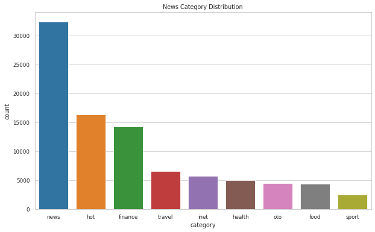

## Indonesian News Title Dataset
This datasets contains more than ***90.000*** Indonesian News Title collected from detik.com, one of the biggest Indonesian news portal. 

The motivation behind this dataset is to enrich the resource in Indonesian NLP environment. This dataset is also very suitable for beginners to start working on real world data! 

## How Data is Collected
The data collection method is simple: it's web scraped using some Python libraries, such as `BeautifulSoup4` 

## Dataset Structure
In the CSV file, you'll find this columns:

| Field | Definition |
|--|--|
|  Date| Date when the news is posted |
| URL | Link to the news in detik.com|
|Title| Title of the news|
|Category|The news category. Enum: `['finance', 'food', 'health', 'hot', 'inet', 'news', 'oto', 'sport',                                                     'travel']`|

So, each title is already labelled to a category so you can exercise lots of data science task on this data: supervised, unsupervised, etc.

For sample of the data, you can access the [sample.csv](https://github.com/ibamibrahim/news-title-dataset/blob/master/sample.csv)

## Data Description
Here are some characteristics of the data:
###  Category Distribution

### Length Distribution

###  Date Distribution

### Word Frequencies

### Authors
If you want to contact the author of this dataset, reach me through:
- **Email**: ibamibrahim0 [at] gmail

